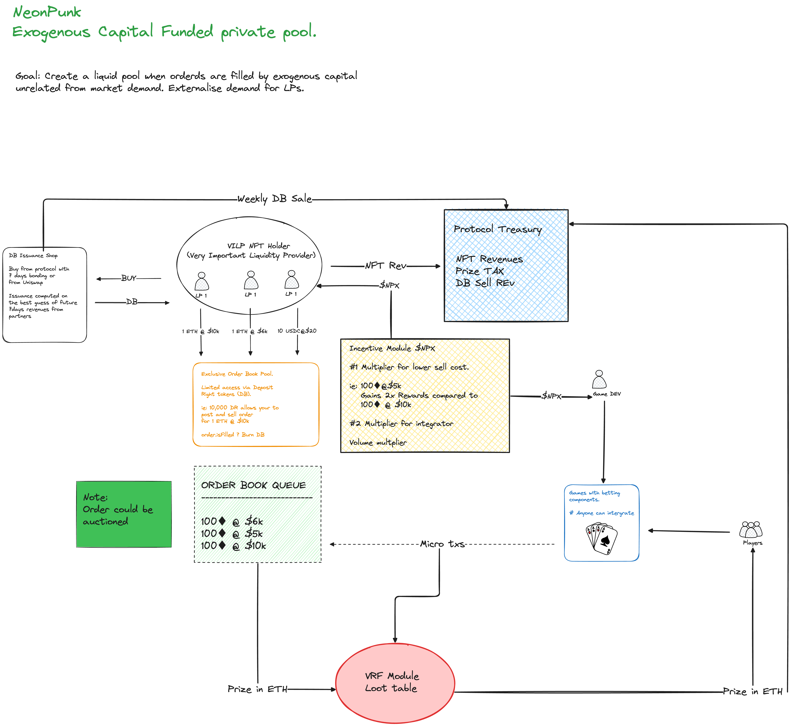

# **NeonPunk Protocol: Liquidity Gaming Fentanyl**

---

### **1. Introduction: ready for liquidity fentanyl?**

What if you could see **ETH at $10,000 today**?  
What if **USDC** could be worth **$2** in your wallet?  

NeonPunk isn’t here to play safe. We’re here to disrupt the liquidity game by merging DeFi mechanics with the adrenaline of high-stakes gaming. Forget waiting for market pumps—this is about seizing the moment.


---

### **2. The Problem: DeFi Is Boring and Everyone’s Chasing Memes**

Let’s stop pretending: DeFi is stale. Yield farming? Played out. Liquidity pools? Meh. Everyone is too busy chasing the next **Shiba 2.0** or **Inu Cum Rocket ButtNigga**. Instead of revolutionizing finance, the space has devolved into a glorified casino, with traders aping into memecoins hoping to strike it rich.

Here’s the truth:  
Platforms like **pump.fun** are launching **thousands of tokens daily**. Last week alone, **31,600 tokens** hit the market in just **24 hours**. You think you can pick a winner? Good luck. The odds of finding a token that actually pumps and sustains value are about as slim as hitting blackjack five times in a row. In fact, **less than 2%** of tokens survive long enough to even make it to a proper listing. The rest? Rugged, forgotten, or outright scams.

You’re not trading; you’re gambling blind. And yet, the market eats it up. Why? Because at least memecoins are exciting.

NeonPunk is here to change the game. We’re bringing the thrill back to DeFi with real odds, real payouts, and a system that doesn’t make you feel like a sucker chasing vaporware.

---

### **3. Real Odds: How Gambling Compares**

You’re already gambling if you’re in DeFi, but let’s compare:

| **Country**   | **Game**           | **Odds of Winning**       | **Payout Ratio**      |
|---------------|---------------------|---------------------------|------------------------|
| **USA**       | Powerball           | 1 in 292,201,338          | ~$0.50 per $1 spent   |
|               | Vegas Slots         | 1 in 12,000 (jackpot)     | 85%-90% payback        |
| **Thailand**  | Lottery Tickets     | 1 in 1,000,000 (big prize)| ~$0.70 per $1 spent   |
| **Spain**     | La Primitiva        | 1 in 139,838,160          | ~$0.55 per $1 spent   |

Compare these to **NeonPunk’s gaming model**:
- Odds as favorable as **1 in 10,000**.
- Transparent, on-chain verification.
- **50%-80% payout efficiency**, with higher liquidity turnover.

---

### **4. Exclusive Liquidity Rights: The Gate to Big Money for Kabala Depositors Only**

NeonPunk isn’t open to just anyone. Access to the protocol’s liquidity pool is **limited** to a select group of users who hold the **NeonPunk Deposit Rights**. 

These rights are tokenized and tradeable, giving their owners the exclusive ability to deposit liquidity and earn massive returns. Why? Because every game, every ticket purchase, and every payout flows through their deposits.

**What does this mean?**  
If you hold a NeonPunk Deposit Right, you’re in control of a high-demand asset. As the protocol grows, so does the value of these rights. This isn’t just passive income—it’s a golden ticket to being part of a system designed to generate continuous cash flow.

---

### **5. How NeonPunk Works**

- **Core Mechanism**: Deposit ETH, USDC, or other tokens, set your sale price, and enter a queue.
- **Gaming Integration**: Use liquidity to power high-stakes games. Every ticket purchased moves you closer to your payout goal.
- **Protocol Fees**: A small cut on every payout sustains the ecosystem while keeping incentives aligned.

---

### **6. Why Play on NeonPunk?**  

- **Best Odds in DeFi**: As low as 1 in 2.
- **Provably Fair**: Every game is verifiable on-chain.
- **Game Diversity**: Multiple game types developed by indipendent teams.

---

### **7. Incentives : Rewarding The Fairest Depositors**

NeonPunk isn’t just about providing liquidity—it’s about optimizing it. Depositors are **incentivized** to offer better odds, creating a more attractive environment for players. 

The rules are simple:  
- The **better the odds**, the **greater the rewards** in **$NPK**.
- **Example**:  
  - Deposit **1 ETH** with a sell price of **$5,000** → **2x $NPK rewards**.  
  - Deposit **1 ETH** with a sell price of **$10,000** → **1x $NPK rewards**.

This dynamic encourages a competitive ecosystem where depositors strive to balance personal profits with system liquidity, keeping the games enticing and the payouts flowing.

---

### **8. Bring Your Own Frontend: Build Your Degen Game, Get Paid**


NeonPunk isn’t just for depositors—it’s an open playground for developers. Anyone can build their own game frontend and hook into the protocol. 

**Here’s how it works**:  
- Create any type of game you want—**weird, wild, or downright degenerate**.
- Direct users to your frontend and let them play.
- Pass a **referral** to the smart contract, and you’ll get rewarded based on the **volume** your game generates.

The more players you bring in, the bigger your cut. **Unleash your creativity** and craft the next big thing—whether it’s a neon slot machine, a dystopian roulette, or something the world has never seen.


---------


# **FAQ: Addressing Key Questions and Concerns**

---

### **1. Is the order book queue strictly FIFO (First-In-First-Out)?**
Not necessarily. While FIFO is a straightforward mechanism, the queue can incorporate additional financial games or prioritize orders by price. For instance:
- Users can pay for FIFO placement.
- Orders may be sorted by price or other factors.

The exact queue mechanism is flexible and can evolve over time to suit the protocol’s goals.

---

### **2. What determines the value of Depositor Rights (DR)?**
The value of Depositor Rights is dynamic and market-driven. Key factors include:
- The scarcity of DR due to the gatekeeping mechanism.
- Expected revenue from deposits.
- The bonding mechanism, which requires buyers to take on risk or buy at a premium on secondary markets.

As the protocol grows, the demand for DR is expected to increase, potentially converging closer to their true market value.

---

### **3. How do integrators fit into the system?**
Integrators play a critical role by integrating their games with the protocol and attracting player volume. Here's how it works:
- **Revenue Sharing:** Integrators collect revenue from players (e.g., $1 per play) and forward it to the NeonPunk protocol.
- **Subsidy:** Integrators receive a subsidy (e.g., $1 revenue might yield $1.5 in NPT tokens) that can be staked for additional rewards.
- **Volume Incentives:** The more player volume an integrator generates, the better their overall rewards and standing.

Integrators essentially compete against one another based on the volume of players they attract.

---

### **4. Why wouldn’t integrators encapsulate payments?**
Integrators have full control over how they structure their pricing and revenue streams. For example:
- An integrator could charge $2 per game round, forward $1 to the protocol, and keep the difference.
- They still benefit from the NeonPunk subsidy system, as well as the rewards associated with higher player volume.

This flexibility ensures that integrators can adapt their strategies to their specific product offerings while aligning with protocol incentives.

---

### **5. How does the system work without randomness (e.g., VRF)?**
Without randomness, the system becomes more like a liquidity pool that game developers can manipulate. However, this creates potential vulnerabilities, such as:
- The odds being skewed in favor of the game developers.
- Reduced fairness and trust in the system.

For this reason, the protocol enforces randomness through a VRF wrapper to guarantee provable fairness and prevent gaming the system.

---

### **6. What happens when integrator pool size grows?**
As more integrators join:
- **Competition increases:** Integrators must compete for player volume to maximize their rewards.
- **Reduced subsidy dependence:** Over time, gatekeeping on DR ensures the protocol generates higher revenues, allowing subsidies to decrease without harming integrator incentives.

This ensures the system remains sustainable while creating long-term value for both the protocol and integrators.

---

### **7. Why does NeonPunk avoid being a DAO?**
Avoiding a DAO structure ensures:
- Greater control over deal-making (e.g., exclusivity agreements, custom subsidies for key integrators).
- Reduced risk of forking or dilution of the system’s value proposition.
- A more centralized approach to building partnerships and scaling the protocol in its early stages.

While this limits certain decentralized aspects, it aligns with the goal of maintaining a competitive edge and preventing exploitation.

---

### **8. What makes this system scalable in the long term?**
The scalability of NeonPunk lies in:
- **Gatekeeping Depositor Rights:** As demand for integration grows, DR scarcity ensures that their value increases, generating more revenue for the protocol.
- **Sustainable Subsidies:** The system is designed to reduce subsidy reliance over time as integrators generate higher revenues.
- **Fair Competition:** Integrators compete on volume and innovation, driving growth across the ecosystem.

---

### **9. How does NeonPunk incentivize integrators to onboard players?**
Integrators benefit from:
- **50% Cashback:** A subsidy mechanism allows integrators to earn more in NPT tokens than their direct revenue.
- **Free Liquidity:** Integrators can plug into the protocol’s liquidity to offer verifiably fair prizes without needing to fund them upfront.
- **Volume-Based Rewards:** Higher player volume means more rewards, creating a direct incentive to onboard as many players as possible.

---

### **10. What happens as the subsidy decreases?**
As the protocol matures and subsidies reduce:
- The value of Depositor Rights increases due to higher protocol revenues, making integration more lucrative.
- Integrators can offset the lower subsidies with increased player volumes and market-driven revenues.
- The protocol gains stability, relying less on bootstrapping mechanisms and more on organic growth.
- 

![Status][test-status]

# Setup

Ensure you have nodejs, yarn and [foundry](https://book.getfoundry.sh/getting-started/installation) installed. Docker is recommended for locally running static analysis.

You can install dependencies with the following command:

```sh
forge build && yarn
```

# CI

Continuous integration is setup via [Github actions](./.github/workflows/run-tests.yml). The following checks are run:

-   Check Formatting has been run with `forge fmt`
-   Run the test suite with `forge test`
-   Check no 'high' or 'medium' priority vulnerabilities are left unaddressed in the static analyser

# Conventions

Below are a list of recommended conventions. Most of these are optional but will give a consistent style between contracts.

## Formatting

Formatting is handled by `forge fmt`. We use the default settings provided by foundry.
You can enable format on save in your own editor but out the box it's not setup. The CI hook will reject any PRs where the formatter has not been run.

A small `.editorconfig` file has been added that standardises things like line endings and indentation, this matches `forge fmt` so the style won't change drastically when you save.

## Linting

`solhint` is installed to provide additional inline linting recommendations for code conventions. You must have NodeJS running for it to work.

## Imports and Remappings

We use import remappings to resolve import paths. Remappings should be prefixed with an `@` symbol and added to `remappings.txt`, in the format:

> Note: ds-test is used internally by forge-std and so leave it as it is.

```
@[shortcut]/=[original-path]/
```

For example:

```
@solmate/=lib/solmate/src/
```

> Remappings may need to be added in multiple config files so that they can be accessed by different tools. For Slither, run `python3 analysis/remappings.py` to add the existing remappings to a `slither.config.json` file.

# Tests

Run tests:

```
forge test [--mp path/to/test/file.sol]
```

Fetch coverage

```
forge coverage
```

# Static Analysis

You can perform static analysis on your contracts using [Slither](https://github.com/crytic/slither). This will run a series of checks against known exploits and highlight where issues may be raised.

## Installing

Slither has a number of dependencies and configuration settings before it can work. You are welcome to install these yourself, but the Dockerfile will handle all of this for you.

There is also an official [Trail of Bits security toolkit](https://github.com/trailofbits/eth-security-toolbox/) you can use, we will not go into detail here.

Both the toolkit and the Dockerfile require docker to be installed. I also recommend you run docker using WSL if you're using Windows.

## Running the Container

The Dockerfile installs dependencies and creates a `/work` directory which mounts the current working directory.

```sh
# make run script executable
chmod +x analyze.sh

# run the docker command
./analyze.sh
```

The analyze script builds and runs the container before dropping you into a shell. You can run slither from there with the `slither` command. You may need to change the solidity compiler you are using, in which case run `solc-select` to get a list of options for installing and selecting specific compilers.

## Addressing issues

CI will fail on unaddressed 'high' or 'medium' issues. These can either be ignored by adding inline comments to solidity files OR using the `--triage-mode` flag provided by slither.

An example inline comment:

```js
function potentiallyUnsafe(address _anywhere) external {
    require(_anywhere == trusted, "untrusted");
    // potentially unsafe operation is ignored by static analyser because we whitelist the call
    // without the next line, the CI will fail
    // slither-disable-next-line unchecked-transfer
    ERC20(_anywhere).transfer(address(this), 1e19);
}
```

# Badges

Edit the markdown in this section to customise badges here.

[test-status]: https://github.com/AuxoDAO/foundry-template/actions/workflows/forge-test.yml/badge.svg

# References

Config Reference for Foundry:

-   https://book.getfoundry.sh/reference/config/
